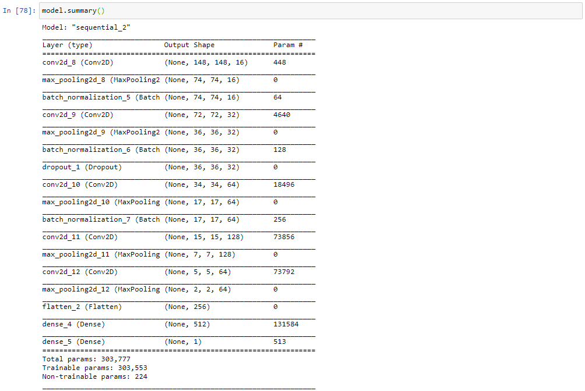
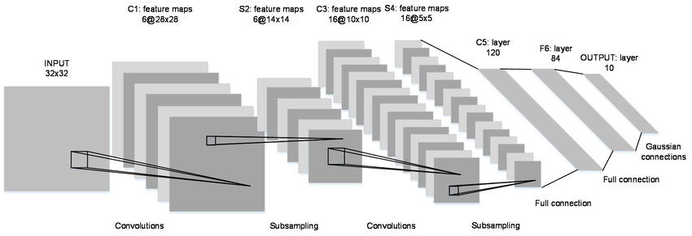
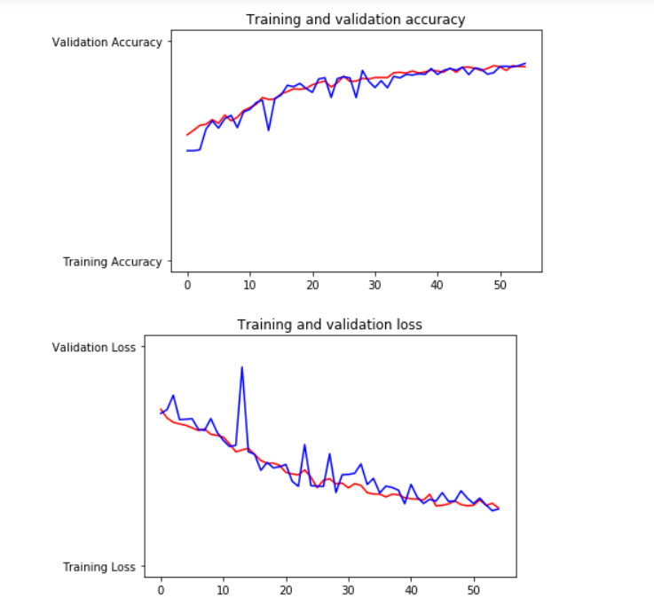
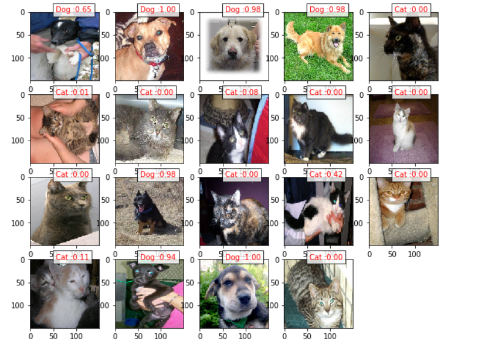

# Dogs vs Cats classifier using convolutional neural nets
The dogs vs cats dataset is one of the first datasets that showed the advantages of using a convolutional neural network for computer vision tasks. the dataset can be found here on [Kaggle](https://www.kaggle.com/c/dogs-vs-cats)

**Resources Used**
-Python 2.7
-Tensor flow 2.0
-packages : numpy,matplotlib

**Model**
A convolutional neural net loosely based on the Lenet5 architecture was used with Batch Normalization and Dropuout regularization to prevent overfitting . relu activations are used in the intermediate layers and a sigmoid activation to calssify at the last layer
the model was only trained for 55 epochs with a batch size of 20 using the adam optimizer without learning rate deccay. 

this is based on the le net architecture which used softmax activations and fewer covolutional layers
the lenet arhcitecure is shown in this picutre

**Training**
the model was trained with 23998images of dogs and cats fed through an image data generator
*shearing and rotating and zooming augmentation techiques were used to get more variety and more data*
a validation set of 1002 images where used as a validation set and the trainging and validation accuracy and loss was measured

the model was ony trained for 55 epochs due to computational power limitations but still managed to get an accuracy of 0.8980 on the validation set 

**Predictions**
here are some predictions that were made with previously unseen images fed into the model .

